```{r setup, include=FALSE}
library("knitr")
knitr::opts_chunk$set(echo = FALSE, cache = TRUE, background = "red",
                      out.width = '3in', out.height = '2in', fig.align = 'center')
```


## ¿Qué es un manuscrito reproducible?

```{r out.width = '3in', out.height = '1.3in'}
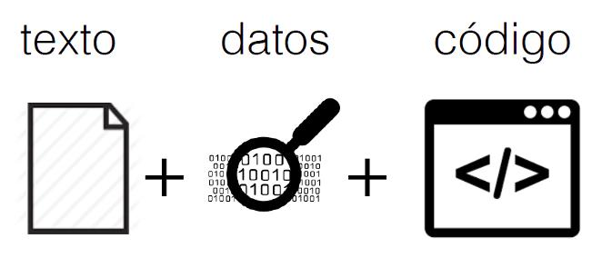
```

DATOS + CÓDIGO 

- **trazar** proceso de análisis

- **reproducir** (regenerar) todos los resultados.


## La ciencia debe ser reproducible 

```{r out.width = '4in', out.height = '2.2in'}
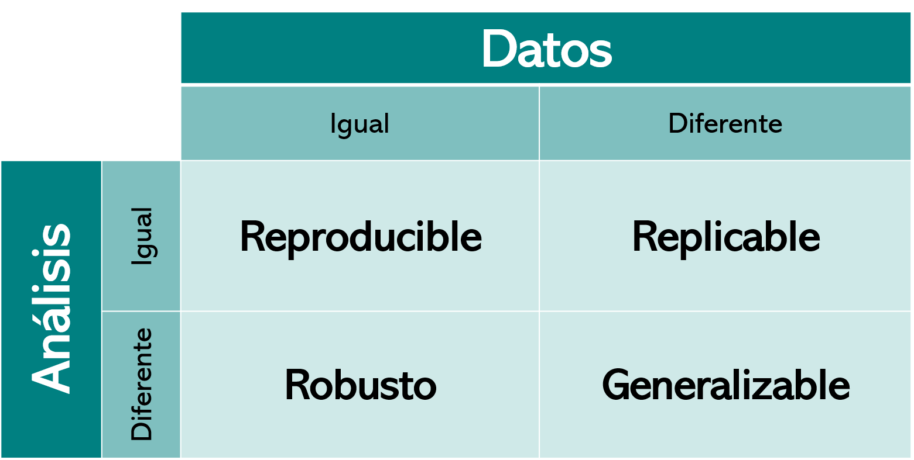
```

\raggedright 
\footnotesize [The Turing Way](https://the-turing-way.netlify.app/welcome)
\raggedleft


## Reproducibilidad: buena para ti, buena para todos

+ Transparencia
+ Trazabilidad
+ Automatización
+ Calidad (- errores)
+ Impacto (citas, reconocimiento)
+ Reutilización (datos y código)
+ Archivo permanente


---

\huge

La inmensa mayoría

de artículos científicos

**NO son reproducibles**

\normalsize


## La reproducibilidad es un gradiente

```{r out.width = '4.5in', out.height = '1.7in'}
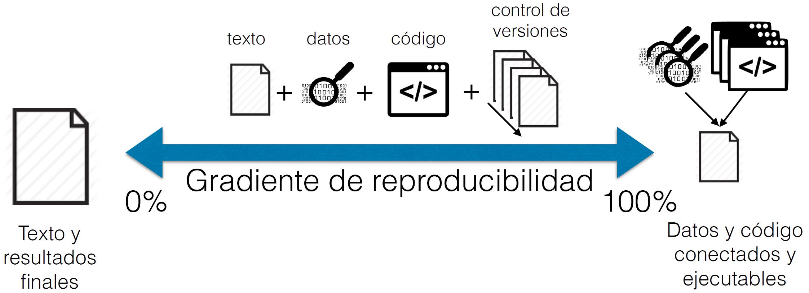
```

\raggedright
\tiny [Rodríguez-Sánchez et al. 2016](https://www.revistaecosistemas.net/index.php/ecosistemas/article/view/1178) (modif. [Peng 2011](https://doi.org/10.1126/science.1213847))
\raggedleft

# Reproducibilidad básica

## Reproducibilidad básica

- **MANUSCRITO** (Texto + Tablas + Figuras)

- **DATOS** (archivo permanente)

- **CÓDIGO** (archivo permanente)

\vspace{10mm}

\footnotesize

*Archivo permanente*: 

- Zenodo, Dryad, OSF, Figshare, Data Paper...

- NO GitHub, web...

\normalsize


## Cómo compartir datos

>- Formato **abierto** (csv, txt)

>- Datos brutos + código depuración

>- **README** (who, what, when, where, why, how)

>- Diccionario (**descripción variables**: `dataspice`, `codebook`)

>- **Licencia** (CC0, CC-BY, ODbL)

>- **Cita** (DOI)

>- **Metadatos** estandarizados (JSON, XML)

\raggedright
\tiny [Tierney & Ram 2020](https://arxiv.org/abs/2002.11626)
\raggedleft


## Cómo compartir código

>- Scripts **texto** (`.R`)

>- **Archivo permanente** (ej. Zenodo) con DOI (citable)

>- [Licencia](https://www.software.ac.uk/resources/guides/adopting-open-source-licence) 

>- **README** (incluir `sessionInfo()`)

\raggedright
\tiny [Eglen et al 2016](https://doi.org/10.1038/nn.4550)
\raggedleft


## `sessionInfo()`: registro del entorno computacional

\tiny

```{r echo=TRUE}
sessionInfo()
```

\normalsize


## Cómo escribir código más reproducible

[BES guide to reproducible code](https://www.britishecologicalsociety.org/wp-content/uploads/2019/06/BES-Guide-Reproducible-Code-2019.pdf)

```{r out.width = '1.8in', out.height = '2.5in'}
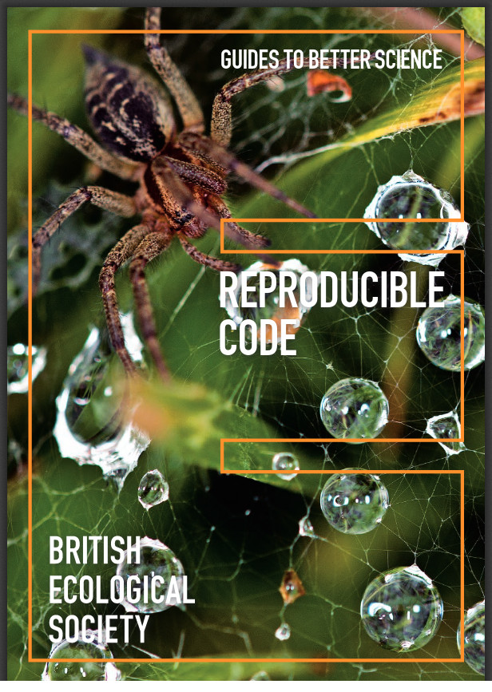
```


## Cómo escribir código más reproducible

[Turing Way](https://the-turing-way.netlify.app)

```{r out.width = '2.5in', out.height = '1.7in'}
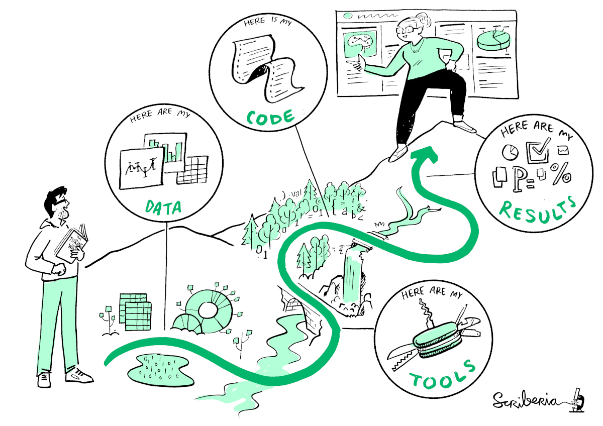
```


## Cómo escribir código más reproducible

```{r out.width = '4in', out.height = '1.2in'}
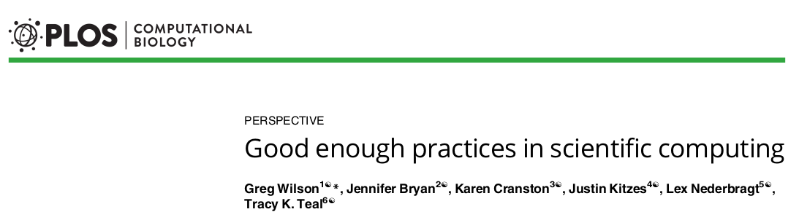
```

\raggedright
\tiny [Wilson et al 2017](https://doi.org/10.1371/journal.pcbi.1005510)
\raggedleft


## Cómo escribir código más reproducible

https://rstats.wtf

```{r out.width = '4in', out.height = '1in'}
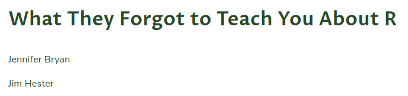
```


## Cómo escribir código más reproducible

`fertile`: creating optimal conditions for reproducibility 

```{r echo = TRUE, eval=FALSE}
library("fertile")
setwd("C:/Users/FRS")
```

*Error: setwd() is likely to break reproducibility. Use here::here() instead.*

\vspace{5mm}

\scriptsize https://github.com/baumer-lab/fertile


## Cómo escribir código más reproducible

Control de versiones (`git`)

```{r out.width = '3.5in', out.height = '1.7in'}
include_graphics("images/git.png")
```

\raggedright
\tiny [R. Fitzjohn](https://github.com/richfitz/reproducibility-2014)
\raggedleft


## Codecheck: ¿es tu artículo reproducible?

https://codecheck.org.uk 

```{r out.width = '2.5in', out.height = '1.3in'}

```


::: hide :::
## Reproducibilidad básica

\large

- **MANUSCRITO** (texto + tablas + figuras)

- **DATOS** (archivo permanente)

- **CÓDIGO** (archivo permanente)

\normalsize


---

\huge

La inmensa mayoría

de artículos científicos

**NO son reproducibles**

\normalsize


## El código existe, pero no se comparte

```{r out.width = '2in', out.height = '2.5in'}
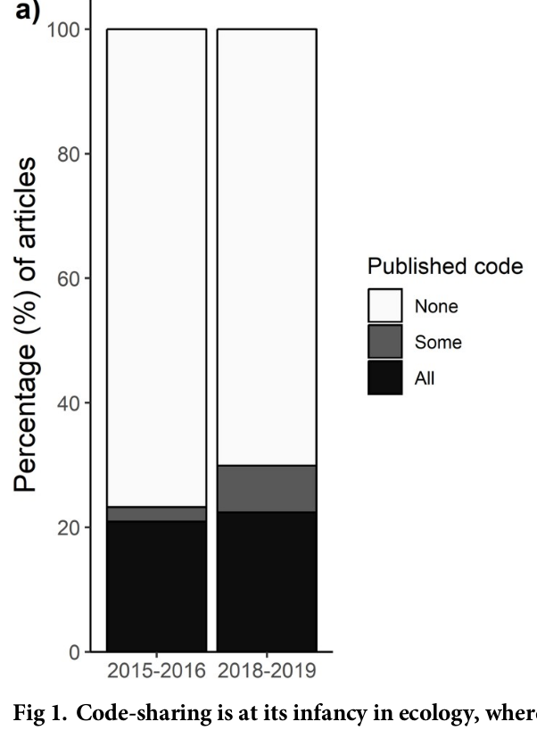
```

\raggedright
\tiny [Antica et al. 2020](https://doi.org/10.1371/journal.pbio.3000763)
\raggedleft

---

\huge

Las barreras

NO son técnicas

\normalsize


## Venzamos las barreras sociológicas

```{r out.width = '3in', out.height = '1in'}
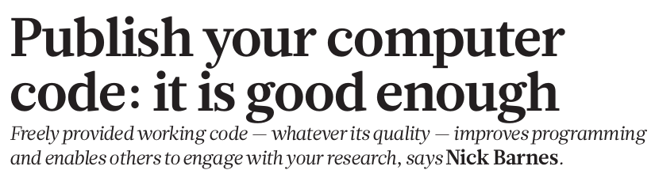
```

\raggedright
\tiny [Barnes 2010](https://doi.org/10.1038/467753a)
\raggedleft

\normalsize

- Comunidad debe ser constructiva (no *shaming*)

- 'Ugly code better than no code'

:::

# 'Literate programming' con Rmarkdown


## Desconexión de código y manuscrito genera problemas

```{r out.width = '3in', out.height = '1in'}

```


'Transcribing numbers **from stats software to ms by hand** 

was the largest source of errors'

\tiny ([Eubank 2016](https://doi.org/10.1017/S1049096516000196))


## Había un dato erróneo...\newline¿Puedes repetir el análisis y actualizar el ms?

Copiar y pegar...

```{r out.width = '3in', out.height = '0.8in'}
#include_graphics("images/copy-paste-table.gif")
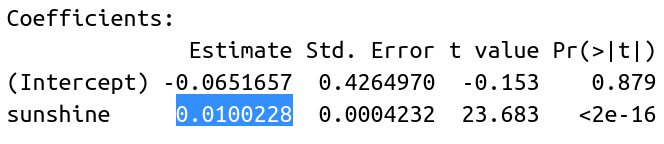
```


::: hide :::
## Las ventajas de la reproducibilidad en <2 minutos

```{r out.width = '3.5in', out.height = '2.2in'}
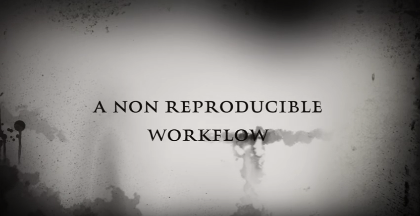
```

\centering https://youtu.be/s3JldKoA0zw

:::

## ¿De dónde sale este número?

```{r out.width = '4.5in', out.height = '1.5in'}
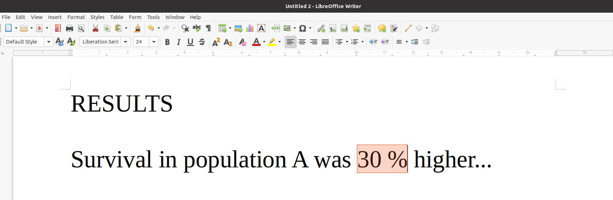
```


## Documentos dinámicos con Rmarkdown

```{r}
surv.diff <- 30
```

*Rmarkdown*:

\ \hspace{5mm} Survival in population A was `` `r inline_expr("surv.diff")` `` % higher

\vspace{6mm}

*Output*:

\ \hspace{5mm} Survival in population A was **`r surv.diff`** % higher


## Documentos dinámicos con Rmarkdown

```{r}
x = runif(86)
y = rnorm(86, 0.3 + 1.1*x, 0.1)
datos <- data.frame(x, y)
```


```{r echo=TRUE, eval=FALSE}
datos <- read.csv("datos.csv")
```

*Rmarkdown:* 

\ \hspace{5mm} We measured `` `r inline_expr("nrow(datos)")` `` individuals

\vspace{5mm}

*Output:* 

\ \hspace{5mm} We measured **`r nrow(datos)`** individuals

\vspace{1cm}

\centering ¡Mucho mejor que copiar y pegar!


## Rmarkdown: texto + código

```{r out.width = '4.5in', out.height = '2.4in'}
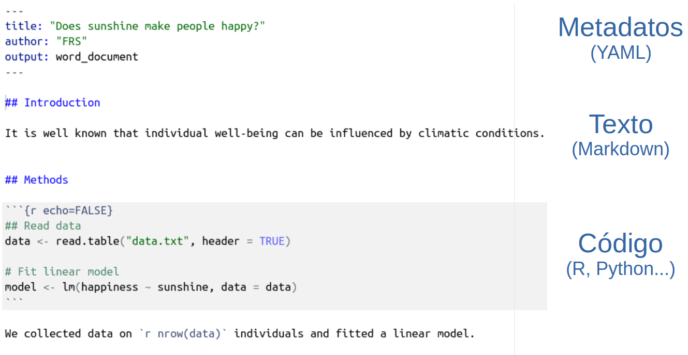
```

## Regenera Word/PDF/html... con un click

```{r out.width = '4.3in', out.height = '2.8in'}
include_graphics("images/Fig3.png")
```


## Rmarkdown: resultados trazables y ejecutables

```{r out.width = '4.5in', out.height = '1.7in'}

```

\raggedright
\tiny [Rodríguez-Sánchez et al. 2016](https://www.revistaecosistemas.net/index.php/ecosistemas/article/view/1178) 
\raggedleft


## Rmarkdown: generación automática de tablas

```{r}
library(xtable)
#model <- lm(y ~ x, data = datos)
datos <- read.table("data.txt", header = TRUE)
model <- lm(happiness ~ sunshine, data = datos)
```

```{r echo=TRUE, eval=FALSE}
model <- lm(happiness ~ sunshine, data = datos)
xtable(model)
```

```{r results = "asis"}
print(xtable(model), comment = FALSE)
```


::: hide :::

## `equatiomatic` describe la estructura de los modelos

We fitted a linear model:

```{r echo=T, results="asis"}
model <- lm(happiness ~ sunshine, data = datos)
equatiomatic::extract_eq(model)
```

:::


## ¡Modelos que se auto-describen!

\scriptsize

```{r echo=T, results="asis"}
library("report")
model <- lm(happiness ~ sunshine, data = datos)
report(model)
```

\normalsize

## Revisa tu gramática

\footnotesize https://github.com/ropenscilabs/gramr

```{r out.width = '6in', out.height = '2in'}
include_graphics("images/gramr.jpg")
```


-----

\large 

¿Cómo incluir la bibliografía

en Rmarkdown?

\normalsize


## `rcrossref`: cita artículos vía DOI

```{r out.width = '3.8in', out.height = '3in'}
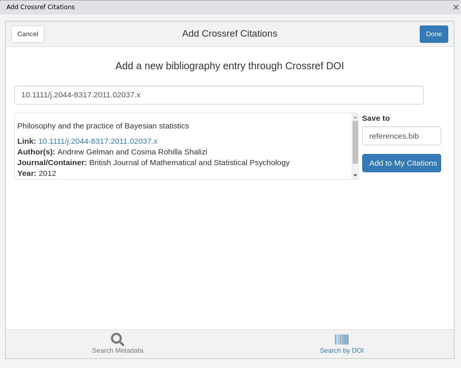
```


## `rcrossref`: búsqueda de artículos

```{r out.width = '3.7in', out.height = '3in'}
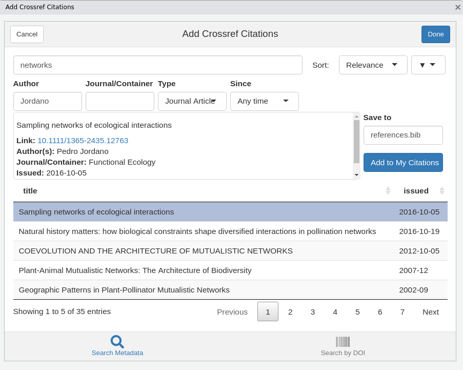
```

## `citr`: citar artículo de base de datos (Zotero)

```{r out.width = '3.2in', out.height = '2.8in'}
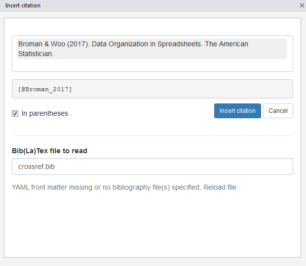
```

## Rstudio 1.4 facilita cita de múltiples fuentes

```{r out.width = '3.5in', out.height = '2.5in'}
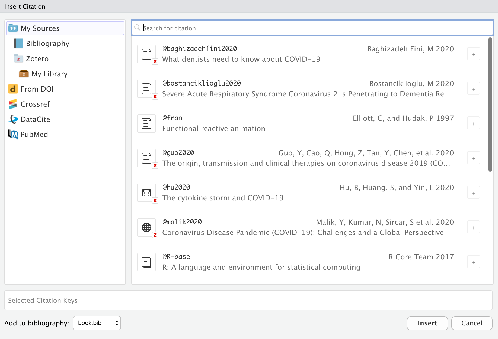
```

\tiny https://rstudio.github.io/visual-markdown-editing/#/citations


## ¡No olvides citar los paquetes de R!

Rmarkdown:

\ \hspace{5mm} `knitr::write_bib()`

\vspace{1cm}

Procesador texto:

\ \hspace{5mm} `grateful::cite_packages()`


## Formatea bibliografía para cualquier revista

```{r out.width = '3in', out.height = '1.2in'}
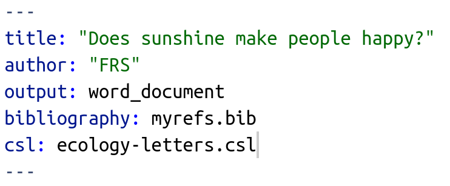
```

Repositorio de 'citation styles' (CSL): 

\scriptsize https://www.zotero.org/styles
\scriptsize https://github.com/citation-style-language/styles


## Plantillas Rmarkdown

\begin{columns}[c] 

\column{0.3\textwidth}

- rticles

- papaja

- rrtools

- pinp

- rmdTemplates

- GitHub!


\column{0.7\textwidth}

```{r out.width = '2.3in', out.height = '2.8in'}
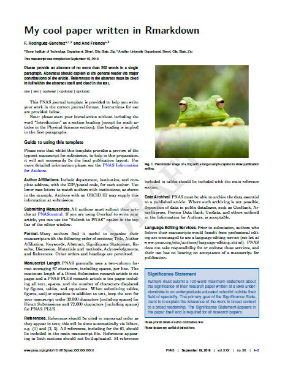
```

\end{columns}


::: hide :::
## ¡No solo R!   Python, Julia, C++, SQL, Stan, etc

`knitr` engines:

```{r warning=FALSE}
kable(matrix(sort(names(knitr::knit_engines$get())), nrow = 6, ncol =7))
```
:::

## Documentos dinámicos con Rmarkdown

https://rmarkdown.rstudio.com/

```{r out.width = '2in', out.height = '2in'}
include_graphics("images/rmdlogo.png")
```


## 'Visual Rmarkdown'en Rstudio 1.4 trae múltiples ventajas

\footnotesize
**¡Como escribir en procesador de texto, pero todas las ventajas de Rmarkdown!**
\normalsize

```{r out.width = '3.2in', out.height = '2.5in'}
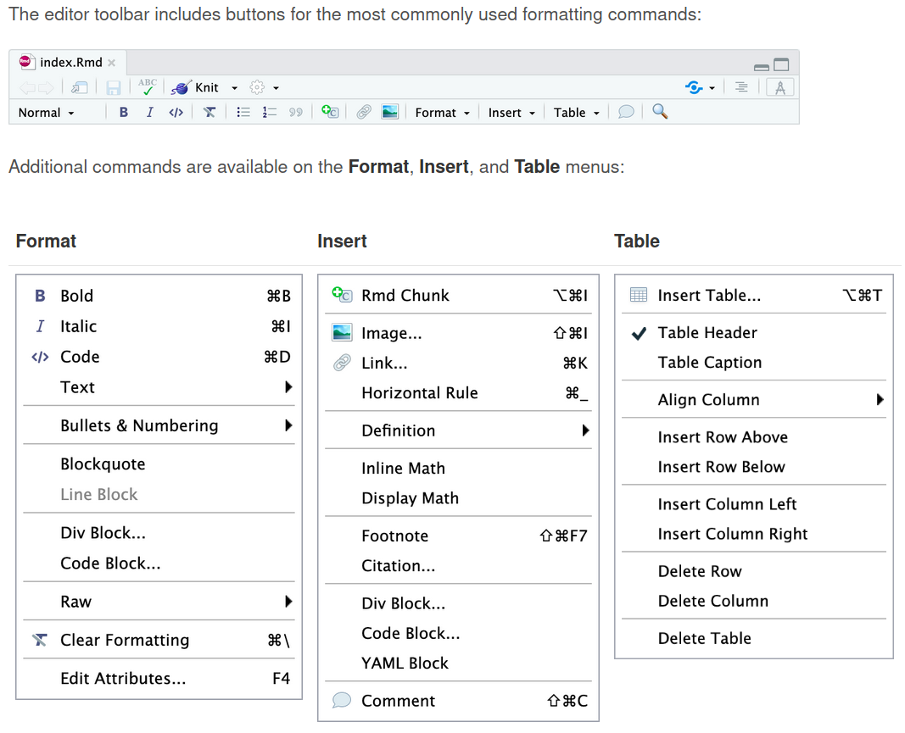
```

\tiny https://rstudio.github.io/visual-markdown-editing


# Control de flujos de trabajo

---

En proyectos complejos es necesario **organizar las piezas**

```{r}
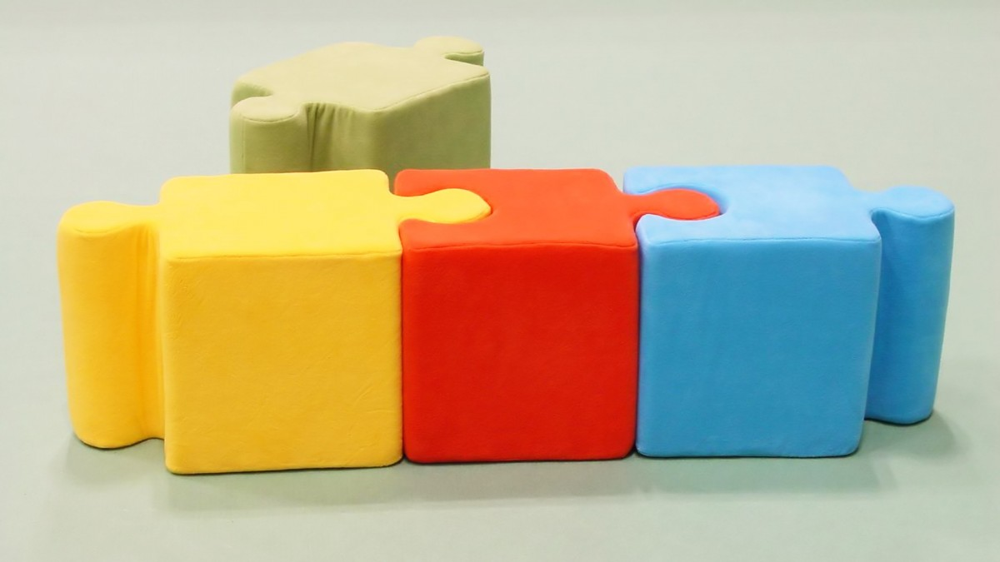
```


## Script maestro ejecuta código en orden adecuado

`makefile.R`

```{r echo=TRUE, eval=FALSE}
source("clean_data.R")

source("fit_model.R")

source("generate_report.R")
```


## Script maestro ejecuta código en orden adecuado

\tiny https://github.com/Pakillo/exclosures-Almoraima

\scriptsize

```{r echo=TRUE, eval=FALSE}
#### READ AND PREPROCESS DATA #####

## Read site info
read_siteinfo("data-raw/sites_info_raw.csv")

## Read and prepare species info
read_sppinfo(sppdata = "data-raw/species_info_raw.csv")

## Prepare dataset
make_dataset()


#### EXPLORATORY ANALYSIS ####
rmarkdown::render("analyses/EDA.Rmd")


#### MANUSCRIPT ####
rmarkdown::render("manuscript/cercados_Almoraima/cercados_Almoraima.Rmd")
```

\normalsize


## `drake`/`targets`: control total del flujo de trabajo

```{r out.width = '4in', out.height = '1.9in'}
include_graphics("images/drake-plan.png")
```

\footnotesize https://docs.ropensci.org/drake/

\footnotesize https://wlandau.github.io/targets/


# Control de dependencias

::: hide :::
---

```{r out.width = '2.3in', out.height = '2.5in'}
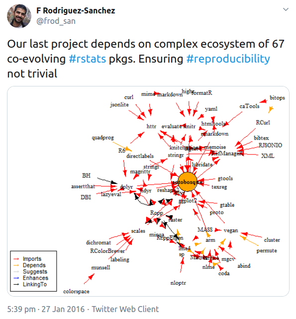
```
:::

---

Cambios en paquetes pueden romper/alterar el análisis

¿Cómo reproducir el análisis dentro de un año, o en otro ordenador?


## `sessionInfo` registra paquetes usados y versiones, OS...

\tiny

```{r echo=TRUE}
sessionInfo()
```

\normalsize


## `checkpoint` reconstruye paquetes en fecha determinada

```{r eval=FALSE, echo=TRUE}
library("checkpoint")
checkpoint("2019-10-08")

source("analysis.R")
```

1. Detecta paquetes usados en el proyecto

2. Instala versión correspondiente a esa fecha (solo CRAN)

3. Instalación independiente (no interfiere con paquetes ya instalados)


## `automagic` registra e instala paquetes (CRAN + GitHub)

\scriptsize

```{r eval=FALSE, echo=TRUE}
automagic::make_deps_file()
```
Crea `deps.yaml` especificando dependencias:
\tiny
```yaml
- Package: equatiomatic
  Repository: CRAN
  Version: 0.1.0
  
- Package: report
  GithubUsername: easystats
  GithubRepo: report
  GithubRef: HEAD
  GithubSHA1: c48a4bb0a40df7116bc502aa3ce2cbbc9d70b7e2
```
\scriptsize
Para instalar todas esas dependencias:
```{r eval=FALSE, echo=TRUE}
automagic()
```

\normalsize

## `renv` también controla las dependencias del proyecto

```{r echo=TRUE, eval=FALSE}
renv::init()

renv::snapshot()   
# Captura dependencias en fichero lockfile

renv::restore()  
# Regenera dependencias a partir del lockfile
```

https://environments.rstudio.com/

---

Para asegurar la reproducibilidad,

además de los paquetes de R

necesitamos controlar 

el **sistema/entorno computacional**


---

\large

`Docker` permite recrear sistemas virtuales

a partir de un `Dockerfile` 

que especifica la configuración

\normalsize

## `liftr`: procesa documento Rmd en un contenedor Docker

```{r out.width = '4.3in', out.height = '1.3in'}
include_graphics("images/liftr.png")
```

\footnotesize https://liftr.me/

## `containerit` facilita creación de Dockerfile

```{r echo=TRUE, eval=FALSE}
library("containerit")

dockfile <- dockerfile(from = "mypaper.Rmd")
```

\footnotesize https://o2r.info/containerit


## `holepunch`: reproduce análisis en la nube (Binder)

```{r out.width = '4in', out.height = '2.5in'}
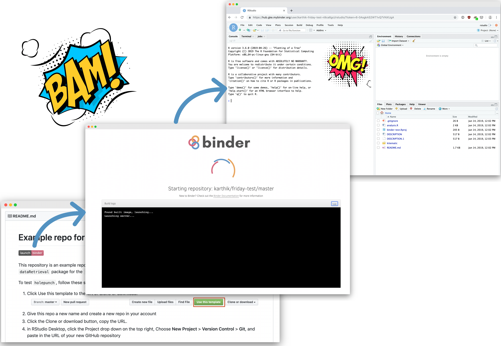
```

\footnotesize https://karthik.github.io/holepunch/


# Organización del proyecto

## Principios sobre organización de proyectos

- Una carpeta con todos los ficheros

- README

- Licencia

- Datos brutos separados de limpios (+ código)

- Funciones independientes del análisis

- Funciones documentadas y testadas

- Makefile

- Control de dependencias

\tiny
[Noble 2009](https://doi.org/10.1371/journal.pcbi.1000424), [Rodriguez-Sanchez et al 2016](https://www.revistaecosistemas.net/index.php/ecosistemas/article/view/1178), [Wilson et al 2017]( https://doi.org/10.1371/journal.pcbi.1005510) 
\normalsize


---

\large

**Research compendium:**

- Datos + Código + Texto

- Estructura de paquete de R

\normalsize


::: hide :::
## Proyectos estructurados como paquetes de R

>- Estructura estándar, consistente

>- Promueve código modular, bien documentado y testado

>- Fácil de compartir y ejecutar

>- Integración continua (Travis, GitHub Actions, etc)

>- Revisión automática del código con `goodpractice`

>- Muy fácil crear website del proyecto con `pkgdown`

\raggedright
\tiny
[Rodríguez-Sánchez et al. 2016](https://www.revistaecosistemas.net/index.php/ecosistemas/article/view/1178), [Marwick et al 2018](https://doi.org/10.1080/00031305.2017.1375986), but see [McBain 2020](https://milesmcbain.xyz/posts/an-okay-idea/)
\raggedleft
:::


## rrtools facilita la creación de compendios

\footnotesize

```{r echo=TRUE, eval=FALSE}
library("rrtools")

use_compendium("~/mynewproject/") # crea proyecto

use_readme_rmd() # crea README

use_analysis() # crea carpeta con manuscrito Rmd

use_dockerfile() # crea Dockerfile

use_travis() # Usa Travis para integración continua

use_testthat() # Usa tests para las funciones
```

\normalsize


## `rrtools.addin` te guía para crear un nuevo proyecto

```{r out.width = '4in', out.height = '1.9in'}
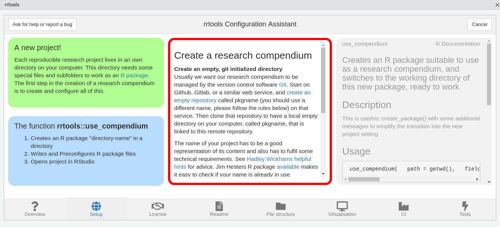
```

\footnotesize https://github.com/nevrome/rrtools.addin


::: hide :::
## Estructura del proyecto

\scriptsize
```
- README
- LICENSE
- DESCRIPTION
- travis.yml
- Dockerfile
- analysis/
  |
  |- paper/
      |- paper.Rmd       
      |- references.bib  
  |
  |- figures/            
  |
  |- data/
      |- raw_data/       
      |- derived_data/   
```
:::


## Estructura del proyecto (con funciones)

\scriptsize
```
- README
- LICENSE
- DESCRIPTION
- travis.yml
- Dockerfile
- analysis/
  |
  |- paper/
      |- paper.Rmd       
      |- references.bib  
  |
  |- figures/            
  |
  |- data/
      |- raw_data/       
      |- derived_data/  
- R/
  |-functions.R
- man/
```

\normalsize


## Integración continua: chequeo continuo tras cada 'commit'

\footnotesize Travis-CI, Circle-CI, GitHub Actions...

```{r out.width = '3.5in', out.height = '2.7in'}
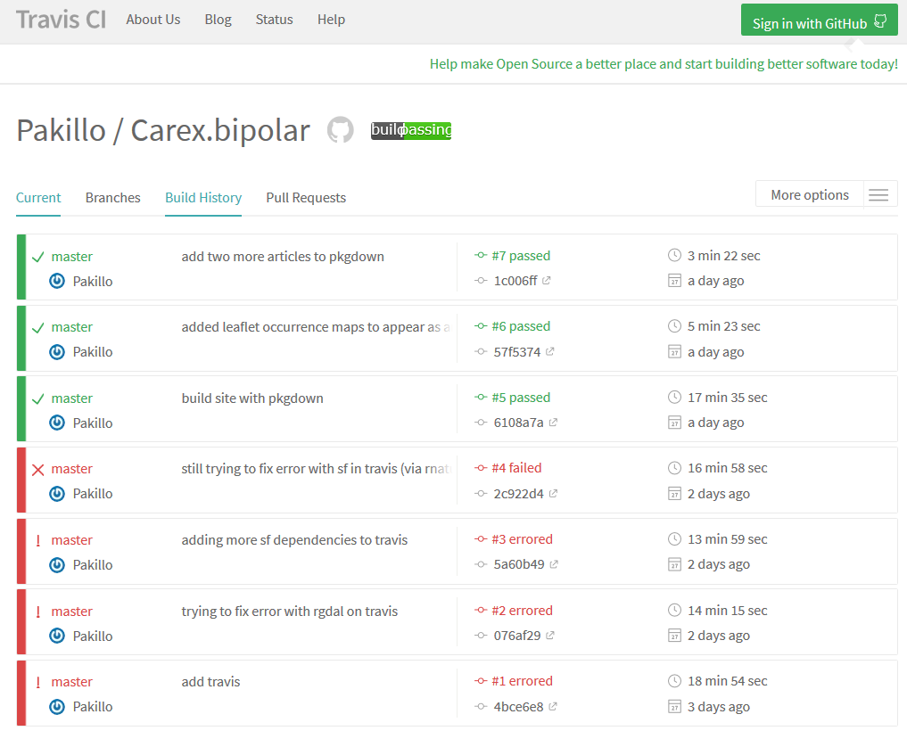
```


## `workflowr`: proyectos reproducibles con website

\footnotesize
```{r echo=TRUE, eval=FALSE}
library("workflowr")
wflow_start("~/newproject")
```
\normalsize

```{r out.width = '3.5in', out.height = '2.5in'}
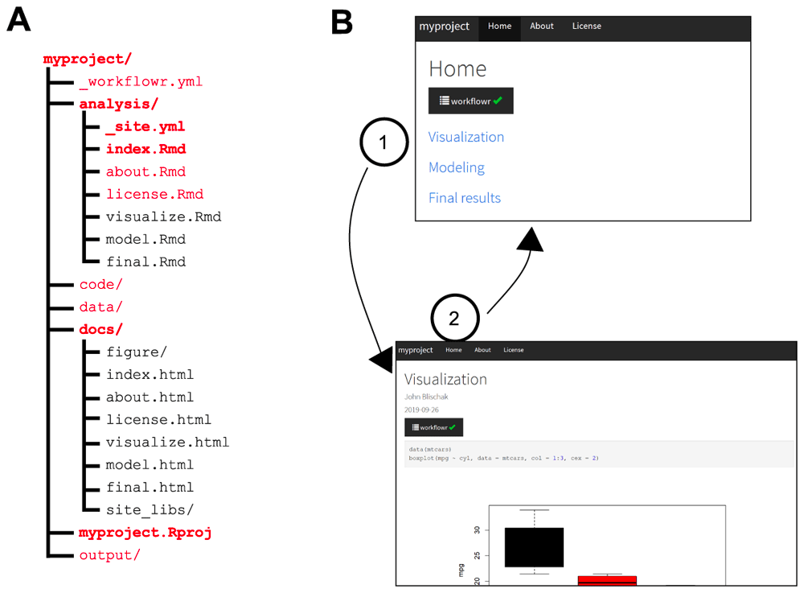
```


# Recapitulación


## Recapitulación

>- **Archivar** DATOS + CÓDIGO

>- **Rmarkdown**: integra análisis + texto en documento dinámico

>- **Control de operaciones**: `makefile`, `drake`/`targets`

>- **Dependencias**: sessionInfo -> paquetes R -> Docker/Guix

>- **Estructura consistente de proyectos**: `rrtools`, `workflowr`...


---

```{r out.width = '4.5in', out.height = '1.7in'}

```


